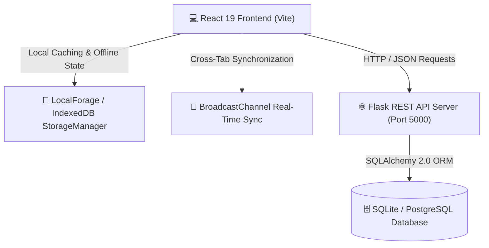

<div align="center">

# 🚀 CampusHub

### Modern Campus Social Collaboration & Innovation Workspace Platform

An end-to-end fullstack platform for colleges and universities to discover campus events, pitch student engineering ideas, manage collaborative project workspaces, run code in real-time terminals, and coordinate student teams.

[](https://react.dev/)
[](https://vitejs.dev/)
[](https://flask.palletsprojects.com/)
[](https://www.sqlalchemy.org/)
[](LICENSE)

---

</div>

## 📌 Table of Contents
- [✨ Key Features](#-key-features)
- [🏗️ System Architecture](#️-system-architecture)
- [💻 Technology Stack](#-technology-stack)
- [📁 Project Structure](#-project-structure)
- [⚡ Quick Start & Local Setup](#-quick-start--local-setup)
- [🔐 Default Test Accounts](#-default-test-accounts)
- [🌐 REST API Documentation](#-rest-api-documentation)
- [🚀 Deployment Guide](#-deployment-guide)
- [📬 Contact & Author](#-contact--author)

---

## ✨ Key Features

### 1. 📢 Campus Social Feed & Discovery
* **Multi-type Posts**: Share campus projects, hackathon announcements, events, ideas, and infrastructure issues.
* **Event Registrations**: Register for upcoming campus events and hackathons with single-click actions and external portal links.
* **Real-time Interaction**: Heart likes, nested discussion comments, share modals, and tag-based filtering.
* **Issue Tracker**: Report campus Wi-Fi, lab equipment, and infrastructure issues with priority badges and admin resolution toggles.

### 2. 💡 Idea Pitching & Contribution Matching
* **Innovation Incubator**: Pitch structured campus ideas with problem statements, proposed solutions, expected impact, and required tech stacks.
* **Role-based Team Recruitment**: Define roles needed (Frontend, Backend, AI/ML, UI/UX, QA, Hardware/IoT).
* **Application & Review Workflow**: Students submit contribution requests with relevant skills; project owners can approve or reject applicants with instant notification alerts.
* **Crowdsourced Support & Following**: Upvote and follow innovative ideas to receive status updates.

### 3. 🛠️ Team Workspaces & Collaborative Hub
* **Automated Workspace Provisioning**: Workspaces are automatically initialized when an idea is launched or when contributors are accepted.
* **Kanban Task Management**: Track tasks across `TODO`, `IN_PROGRESS`, and `DONE` states with assignees, checklist items, and priority tags.
* **Milestone Roadmaps**: Create phased sprint deliverables with progress trackers.
* **Multi-Channel Team Chat**: Real-time channels (`#general`, `#dev-engineers`, `#design-team`, `#announcements`) with emoji reactions, message replies, code snippet attachments, and 1,000-character limits.
* **Interactive Code Terminal**: In-browser JavaScript and Python runtime simulation with API benchmarking suites, algorithm testing, and direct "Share to Chat" integration.
* **File & Document Repository**: Categorized asset management (Design, Architecture, Docs, Research).
* **Activity Audit Log**: Real-time workspace audit trails of team actions, task completions, and roadmap updates.

### 4. 🛡️ Strict Lifecycle Rules & Access Control
* **Cascading Idea-Workspace Deletion**: Deleting an idea immediately cascades to close and delete its linked workspace, tasks, discussions, files, and chat messages.
* **Private Workspace Access Gating**: Non-members attempting to access private workspaces are gated with a security screen and prompted to submit a contribution request.
* **Leave Workspace Workflow**: Contributors can leave a workspace with a confirmation prompt; their access is revoked, and they can re-apply through the Ideas page anytime.
* **Full Contributor Visibility**: When new or rejoining contributors are approved, all historical workspace chats, tasks, files, and discussions are immediately visible.

### 5. 🔑 Security & Authentication
* **JWT & SHA-256 Hashing**: Token-based authentication with client and server password hashing.
* **Self-Registration**: New students and faculty can register dynamic accounts with custom avatars, department, and bio.
* **Forgot Password Recovery**: Interactive 2-step verification code dispatch and OTP reset with real-time password strength metering.

---

## 🏗️ System Architecture



---

## 💻 Technology Stack

| Layer | Technologies |
|---|---|
| **Frontend Framework** | React 19, Vite 8, React DOM |
| **Styling & Effects** | Vanilla CSS Tokens, Glassmorphism UI, HTML5 Canvas VFX (WarpSpeed, Void, Sun) |
| **Icons & UI Components** | Lucide React, Custom Portals, Popups, Modals |
| **State & Offline Storage** | LocalForage, IndexedDB, Web BroadcastChannel API |
| **Backend API** | Python 3.10+, Flask, Flask-CORS, PyJWT, Werkzeug Security |
| **Database & ORM** | SQLAlchemy 2.0, SQLite (WAL mode) / PostgreSQL |
| **Deployment & Server** | Gunicorn, Waitress, Vercel, Render, Docker |

---

## 📁 Project Structure

```
campushub/
├── backend/                  # Python Flask REST API
│   ├── app/
│   │   ├── models/           # SQLAlchemy Data Models (User, Post, Idea, Workspace, Task, Chat...)
│   │   ├── routes/           # Blueprint Endpoints (auth, posts, ideas, workspaces, notifications...)
│   │   ├── utils/            # JWT Helpers, Hashing, Seed Data generator
│   │   └── config.py         # App Configuration
│   ├── requirements.txt      # Python Dependencies
│   ├── run.py                # Development Server Runner
│   ├── seed.py               # Database Reset & Seeding Script
│   └── wsgi.py               # WSGI Production Entrypoint
├── src/                      # React 19 Frontend
│   ├── components/
│   │   ├── common/           # FormattedText, ModalPortal, PopupDialog, UserProfileModal
│   │   ├── ideas/            # IdeasPage, IdeaCard, SubmitIdeaModal, JoinContributionModal...
│   │   ├── posts/            # CreatePost, PostPreview, MediaUploader, DraftsModal...
│   │   ├── workspace/        # WorkspacesPage, WorkspaceChat, WorkspaceTasks, Terminal...
│   │   └── LoginPage.jsx     # Login, Registration & Forgot Password Modals
│   ├── data/                 # Clean Seed Data (seedIdeasAndWorkspaces.js)
│   ├── services/             # API client, NetworkManager, StorageManager
│   ├── App.jsx               # Root Application Component
│   ├── index.css             # Design System & Responsive Styling
│   └── main.jsx              # Vite Entrypoint
├── index.html                # Single Page HTML5 Template
├── render.yaml               # Render Cloud Blueprint
├── vercel.json               # Vercel Deployment Configuration
└── package.json              # Frontend Node Dependencies
```

---

## ⚡ Quick Start & Local Setup

### Prerequisites
* **Node.js**: v18.0 or higher
* **Python**: v3.10 or higher
* **Git**

### 1. Clone the Repository
```bash
git clone https://github.com/Jashvanthan/campushub.git
cd campushub
```

### 2. Frontend Setup
```bash
npm install
npm run dev
```
*Frontend runs at:* `http://localhost:5173`

### 3. Backend Setup
Open a second terminal:
```bash
# Create and activate Python virtual environment
python -m venv venv

# Windows:
.\venv\Scripts\activate
# macOS/Linux:
source venv/bin/activate

# Install dependencies
pip install -r backend/requirements.txt

# Seed the database
python backend/seed.py

# Run the Flask backend
python backend/run.py
```
*Backend API runs at:* `http://localhost:5000`

---

## 🔐 Default Test Accounts

Out of the box, the system is seeded with two primary accounts for testing multi-user collaboration:

| Role | Username | Password | Purpose |
|---|---|---|---|
| **Campus Admin** | `admin` | `Admin@2025!` | Full administrative moderation, post management, and project oversight |
| **Student Contributor** | `student1` | `Student@2025!` | Idea creator, project lead, workspace collaborator |

> 💡 *You can also click **Register** on the login page to create any custom student or faculty account.*

---

## 🌐 REST API Documentation

### Authentication (`/api/auth`)
* `POST /api/auth/register` — Register a new student/faculty account.
* `POST /api/auth/login` — Authenticate and receive JWT access token.
* `POST /api/auth/forgot-password` — Request a password reset verification code.
* `POST /api/auth/reset-password` — Validate OTP and update account password.
* `GET /api/auth/me` — Fetch current authenticated user profile.

### Posts & Feed (`/api/posts`)
* `GET /api/posts` — Retrieve paginated feed posts.
* `POST /api/posts` — Create a new post, event, project, or issue.
* `PUT /api/posts/<id>` — Edit post content or resolve issue.
* `DELETE /api/posts/<id>` — Delete post and cascade cleanup.
* `POST /api/posts/<id>/like` — Toggle like.
* `POST /api/posts/<id>/comments` — Add comment.

### Ideas & Incubation (`/api/ideas`)
* `GET /api/ideas` — List active campus ideas.
* `POST /api/ideas` — Submit a new idea and optionally initialize workspace.
* `DELETE /api/ideas/<id>` — Delete idea and close associated workspace.
* `POST /api/ideas/<id>/contribute` — Submit contribution request.
* `POST /api/ideas/<id>/support` — Toggle student support vote.

### Collaborative Workspaces (`/api/workspaces`)
* `GET /api/workspaces` — List accessible active workspaces.
* `GET /api/workspaces/<id>` — Get workspace details, tasks, milestones, discussions, files, and chat messages.
* `POST /api/workspaces/<id>/leave` — Contributor leave workspace endpoint.
* `POST /api/workspaces/<id>/tasks` — Create workspace task.
* `POST /api/workspaces/<id>/chat` — Post message in workspace channel.
* `POST /api/workspaces/<id>/discussions` — Start discussion thread.
* `POST /api/workspaces/<id>/files` — Upload document/asset metadata.

---

## 🚀 Deployment Guide

### Vercel (Frontend)
1. Push your repository to GitHub.
2. Import repository in [Vercel Dashboard](https://vercel.com).
3. Set Framework Preset to **Vite**.
4. Set Build Command to `npm run build` and Output Directory to `dist`.
5. Add Environment Variable: `VITE_API_URL=https://your-backend-service.onrender.com`.

### Render (Backend)
1. Connect your GitHub repository to [Render](https://render.com).
2. Create a new **Web Service** with:
   - **Runtime**: `Python 3`
   - **Build Command**: `pip install -r backend/requirements.txt`
   - **Start Command**: `gunicorn -w 4 -b 0.0.0.0:$PORT backend.wsgi:app`
3. Add Environment Variables:
   - `FLASK_ENV=production`
   - `JWT_SECRET_KEY=your-secure-random-key`
   - `CORS_ORIGINS=https://your-app.vercel.app`

---

## 📬 Contact & Author

* **Author**: Jashvanthan A
* **Email**: [jashvan467@gmail.com](mailto:jashvan467@gmail.com)
* **LinkedIn**: [linkedin.com/in/jashvanthan-ashok-90ba60338](https://www.linkedin.com/in/jashvanthan-ashok-90ba60338)
* **GitHub**: [@Jashvanthan](https://github.com/Jashvanthan)

---

<div align="center">
  <sub>Built with ❤️ for student innovators, engineers, and creators.</sub>
</div>
