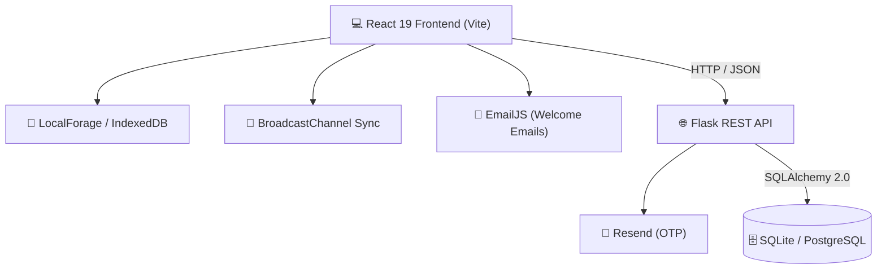

<div align="center">

# 🚀 CampusHub

### From campus idea → team → shipped product

**Instagram + GitHub + Unstop for college talent**, powered by a recommendation engine.

[**🔗 Live Demo**](https://campushub-cyan.vercel.app/) · [**🐞 Report a Bug**](https://github.com/Jashvanthan/campushub/issues) · [**💡 Request a Feature**](https://github.com/Jashvanthan/campushub/issues)

[](https://react.dev/)
[](https://vitejs.dev/)
[](https://flask.palletsprojects.com/)
[](https://www.sqlalchemy.org/)
[](LICENSE)

⭐ **If you like CampusHub, please star the repo. It keeps the project moving!**

</div>

---

## 🎯 The Problem

Every campus is full of talented students and great ideas, but most never ship. There's no single place to **pitch an idea, find the right teammates, plan the work, and get noticed**. Projects end up scattered across WhatsApp groups, GitHub repos, event portals and social media.

## 💡 The Solution

CampusHub brings the whole journey into one platform:

| Step | What students do | Inspired by |
|---|---|---|
| **Discover** | Get personalized project, idea and event recommendations | Instagram, Unstop |
| **Pitch** | Share ideas with problem, solution, impact and tech stack | Unstop |
| **Team up** | Recruit contributors by role and review applications | GitHub |
| **Build** | Work in auto-created workspaces with tasks, chat and code | GitHub |
| **Get seen** | Showcase work on the campus feed | Instagram |

---

## 📸 Screenshots

> Add 3–4 screenshots here: feed, idea pitch, workspace (Kanban + chat), dark/light themes.

<!--   -->

---

## ✨ Features

### 🎯 Recommendations
Personalized suggestions of projects, ideas and events for each student.
<!-- TODO: add 1–2 lines on how it works (e.g. skills/tags matching, activity signals) -->

### 📢 Campus Feed
- Post projects, hackathons, events, ideas and campus issues
- Like, comment (nested replies), share, and filter by tags
- One-click event registration with external portal links
- **Issue tracking** where only the author or an Admin can resolve, reopen or clear an issue

### 💡 Idea Incubator
- Structured pitches: problem, solution, expected impact, tech stack
- Role-based recruitment: Frontend, Backend, AI/ML, UI/UX, QA, Hardware/IoT
- Apply, approve or reject workflow with instant notifications
- Upvote and follow ideas for status updates

### 🛠️ Team Workspaces
Auto-provisioned when an idea launches or contributors are accepted:
- **Kanban board** (TODO / IN_PROGRESS / DONE) with assignees, checklists and priorities
- **Milestone roadmaps** with progress tracking
- **Team chat** with channels, reactions, replies and code snippets
- **In-browser code terminal** (JavaScript and Python) with "Share to Chat"
- **File repository** organized by Design, Architecture, Docs and Research
- **Activity audit log** of task and roadmap updates

### 🔑 Auth and Emails
- JWT-based authentication with role-based permissions (student, faculty, admin)
- Welcome emails via EmailJS
- 6-digit OTP password reset via Resend (10-minute expiry)

### 🎨 Experience
- Dark mode (cosmic glassmorphism) and light mode (slate and orange)
- Mobile-responsive navigation and offline-friendly state with IndexedDB

---

## 🗺️ Roadmap

| Status | Milestone |
|---|---|
| ✅ Done | Feed, idea incubator, team workspaces, auth, recommendations |
| 🚧 Next | **Engagement:** video uploads with a reels-style scrolling feed for project demos |
| 🚧 Next | **Smart team allocation:** match students to ideas by skill fit |
| 📅 Planned | **Opportunities:** job market where recruiters discover students through real work |
| 📅 Planned | **Investor connect:** visibility for strong student startups |
| 📅 Planned | **AI layer:** skill-gap analysis, idea feedback, auto-generated task plans, portfolio building |
| 🔒 Ongoing | **Security hardening:** move password hashing to bcrypt/argon2, rate limiting, input validation |

**Vision:** a campus where talent is discovered, funded and hired for what it *builds*, not what's on a resume.

---

## 🏗️ Architecture



## 💻 Tech Stack

| Layer | Technologies |
|---|---|
| Frontend | React 19, Vite 8, Lucide React, vanilla CSS tokens |
| Offline and sync | LocalForage, IndexedDB, BroadcastChannel API |
| Backend | Python 3.10+, Flask, Flask-CORS, PyJWT, Werkzeug |
| Database | SQLAlchemy 2.0, SQLite (WAL) / PostgreSQL |
| Email | EmailJS (welcome), Resend (OTP) |
| Deployment | Vercel (frontend), Render (backend), Gunicorn, Docker |

<details>
<summary><b>📁 Project Structure</b></summary>

```
campushub/
├── backend/                  # Flask REST API
│   ├── app/
│   │   ├── models/           # User, Post, Idea, Workspace, Task, Chat...
│   │   ├── routes/           # auth, posts, ideas, workspaces, notifications
│   │   ├── utils/            # JWT, email, hashing, seed generator
│   │   └── config.py
│   ├── requirements.txt
│   ├── run.py                # Dev server
│   ├── seed.py               # DB reset and seed
│   └── wsgi.py               # Production entrypoint
├── src/                      # React frontend
│   ├── components/           # common, ideas, posts, workspace, LoginPage
│   ├── data/                 # Seed data
│   ├── services/             # API client, EmailJS, NetworkManager, StorageManager
│   ├── App.jsx
│   ├── index.css
│   └── main.jsx
├── .env.example
├── render.yaml
├── vercel.json
└── package.json
```
</details>

---

## ⚡ Quick Start

**Prerequisites:** Node.js 18+, Python 3.10+, Git

```bash
git clone https://github.com/Jashvanthan/campushub.git
cd campushub
cp .env.example .env
```

**Frontend** (runs at `http://localhost:5173`)
```bash
npm install
npm run dev
```

**Backend** (runs at `http://localhost:5000`), in a second terminal
```bash
python -m venv venv
source venv/bin/activate        # Windows: .\venv\Scripts\activate
pip install -r backend/requirements.txt
python backend/seed.py
python backend/run.py
```

### ⚙️ Environment Variables

```env
# Frontend
VITE_API_URL=http://localhost:5000
VITE_EMAILJS_SERVICE_ID=service_xxxxxxx
VITE_EMAILJS_TEMPLATE_ID=template_xxxxxxx
VITE_EMAILJS_PUBLIC_KEY=xxxxxxxxxxxxxxx

# Backend (backend/.env)
RESEND_API_KEY=re_xxxxxxxxxxxxxxxxxxxx
RESEND_FROM_EMAIL=CampusHub Security <onboarding@resend.dev>
SECRET_KEY=your_secret_key_here
DATABASE_URL=sqlite:///campushub.db
PORT=5000
```

### 🔐 Demo Accounts (local seed data only)

| Role | Username | Password |
|---|---|---|
| Campus Admin | `admin` | `Admin@2025!` |
| Student | `student1` | `Student@2025!` |

> ⚠️ These exist for local testing only. Change or remove them before any public deployment. You can also register your own account on the login page.

---

## 🌐 API Overview

| Area | Endpoints |
|---|---|
| **Auth** `/api/auth` | `POST /register` · `POST /login` · `POST /forgot-password` · `POST /reset-password` · `GET /me` |
| **Posts** `/api/posts` | `GET /` · `POST /` · `PUT /<id>` · `DELETE /<id>` · `POST /<id>/like` · `POST /<id>/comments` |
| **Ideas** `/api/ideas` | `GET /` · `POST /` · `DELETE /<id>` · `POST /<id>/contribute` · `POST /<id>/support` |
| **Workspaces** `/api/workspaces` | `GET /` · `GET /<id>` · `POST /<id>/leave` · `POST /<id>/tasks` · `POST /<id>/chat` · `POST /<id>/discussions` · `POST /<id>/files` |

Edit and delete on posts are restricted to the author or an Admin.

---

## 🚀 Deployment

**Frontend on Vercel:** import the repo, set preset to **Vite**, build command `npm run build`, output `dist`, and add the `VITE_*` variables.

**Backend on Render:** create a Python web service.
- Build: `pip install -r backend/requirements.txt`
- Start: `gunicorn -w 4 -b 0.0.0.0:$PORT backend.wsgi:app`
- Env: `FLASK_ENV=production`, `SECRET_KEY`, `RESEND_API_KEY`, `CORS_ORIGINS=https://your-app.vercel.app`

---

## 🤝 Contributing

Contributions, issues and feature requests are welcome.
1. Fork the repo and create a branch: `git checkout -b feature/your-feature`
2. Commit your changes and open a Pull Request

## 💬 Feedback

Tried the app? I'd love to hear what worked, what broke and what's missing. Open an [issue](https://github.com/Jashvanthan/campushub/issues) or reach out below.

## 📬 Author

**Jashvanthan A**, third-year CSE student
[LinkedIn](https://www.linkedin.com/in/jashvanthan-ashok-90ba60338) · [GitHub](https://github.com/Jashvanthan) · [Email](mailto:jashvan467@gmail.com)

<div align="center">
  <sub>Built with ❤️ for student innovators, engineers and creators. If this helped you, ⭐ the repo!</sub>
</div>
